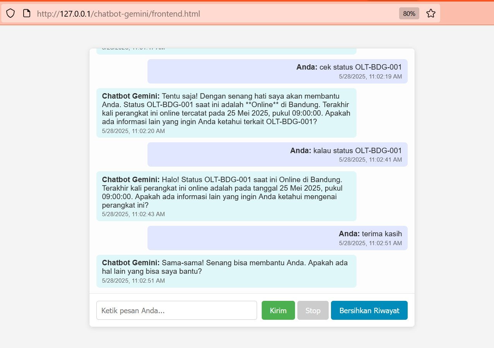
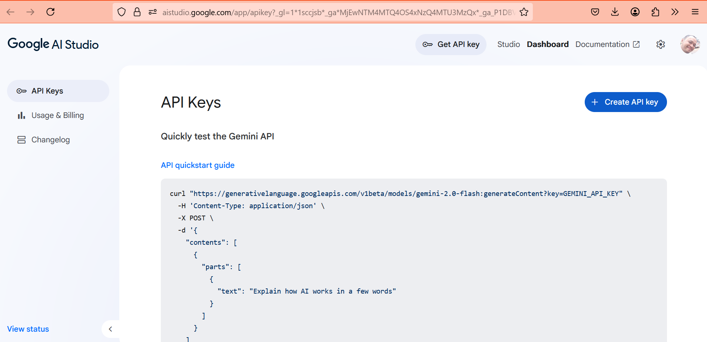
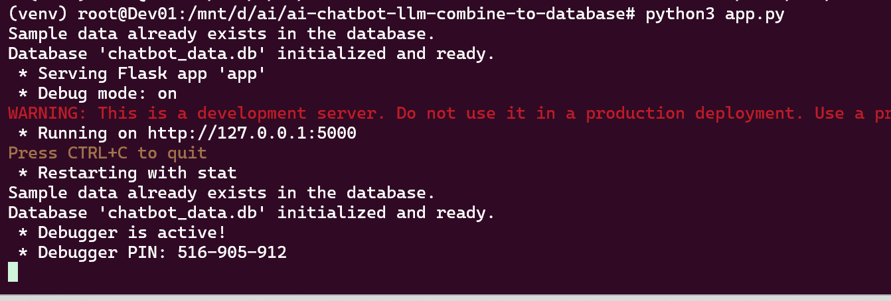

# Chatbot Combining AI LLM & SQL Database

Machine Learning (ML) is a branch of artificial intelligence (AI) that studies patterns and makes predictions based on data.

LLM, or Large Language Model, is a type of ML model trained using a massive amount of text to understand and generate natural language.

The code example presented here demonstrates a combination of AI LLM and a SQL Database to answer user questions by integrating with internal data.

For instance, to inquire about the online status of a device, the data flow will involve querying an internal database to retrieve the device's status.

The example below utilizes the Gemini LLM API.



Video Demo ->  & Video Demo -> 

-----

## Table of Contents

  * [1. Create Gemini API Key](https://www.google.com/search?q=%231-create-gemini-api-key)
  * [2. Python & Dependencies Installation](https://www.google.com/search?q=%232-python--dependencies-installation)
  * [3. Creating the Chatbot Backend Program](https://www.google.com/search?q=%233-creating-the-chatbot-backend-program)
  * [4. Creating the Chatbot Frontend Program](https://www.google.com/search?q=%234-creating-the-chatbot-frontend-program)

-----

## 1\. Create Gemini API Key

The first step is to create an API Key on aistudio.google.com to access the Gemini AI LLM using its API.



## 2\. Python & Dependencies Installation

To set up the Python environment and install the necessary libraries, follow these steps:

```bash
apt install python3.10-venv
python3 -m venv venv
source venv/bin/activate
pip install Flask Flask-Cors google-generativeai python-dotenv
```

## 3\. Creating the Chatbot Backend Program

Below is the Python script for the backend, which processes user queries by integrating the Gemini LLM API and a local Database.


**How to Run:**

```bash
python3 app.py
```




## 4\. Creating the Chatbot Frontend Program

Below is the script for the web-based frontend program that processes questions and displays AI-generated answers. This frontend can be run on a web server like Apache or Nginx, or simply by opening the HTML file directly in your browser while the backend is running.


